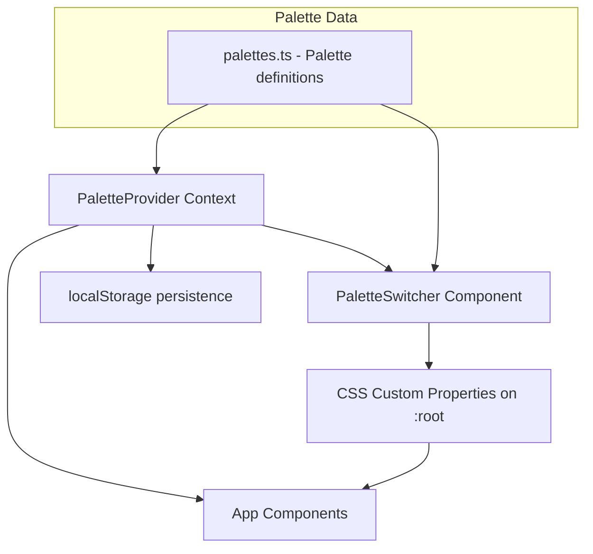
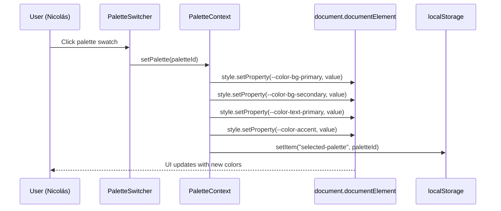
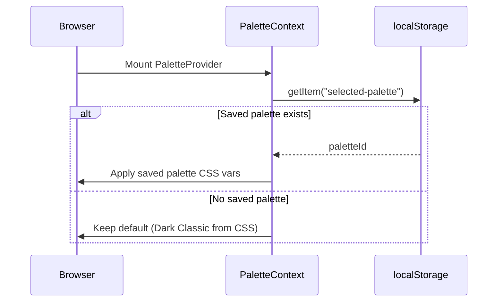

# Design Document: Palette Switcher / Theme Picker

## Overview

El Palette Switcher es un componente UI flotante que permite al usuario final (Nicolás, el cliente del fotógrafo) previsualizar y cambiar entre las 4 paletas de colores definidas en el proyecto en tiempo real. El componente sobrescribe las CSS custom properties en `:root` dinámicamente, logrando una transición instantánea sin recarga de página.

La arquitectura se basa en un React Context que gestiona el estado de la paleta activa, un componente flotante con botones de color para cada paleta, y la aplicación de variables CSS en runtime mediante `document.documentElement.style.setProperty()`. Se persiste la selección en `localStorage` para que la paleta elegida se mantenga entre sesiones de preview.

## Architecture



## Sequence Diagrams

### Palette Switch Flow



### Initial Load Flow



## Components and Interfaces

### Component 1: PaletteProvider

**Purpose**: React Context provider que gestiona el estado global de la paleta activa y expone métodos para cambiarla.

**Interface**:
```typescript
interface PaletteContextValue {
  activePaletteId: string;
  setPalette: (paletteId: string) => void;
  palettes: Palette[];
}
```

**Responsibilities**:
- Mantener el estado de la paleta activa
- Aplicar las CSS custom properties al `document.documentElement` cuando cambia la paleta
- Persistir la selección en `localStorage`
- Restaurar la paleta guardada al montar el componente

### Component 2: PaletteSwitcher

**Purpose**: Componente UI flotante que muestra los swatches de color y permite al usuario seleccionar una paleta.

**Interface**:
```typescript
interface PaletteSwitcherProps {
  position?: 'bottom-right' | 'bottom-left' | 'top-right' | 'top-left';
}
```

**Responsibilities**:
- Renderizar un botón toggle para abrir/cerrar el panel de paletas
- Mostrar un swatch de color para cada paleta disponible
- Indicar visualmente cuál paleta está activa
- Ser accesible (ARIA labels, keyboard navigation)
- Ser responsive (funcionar en mobile y desktop)

## Data Models

### Palette

```typescript
interface Palette {
  id: string;
  name: string;
  colors: PaletteColors;
}

interface PaletteColors {
  bgPrimary: string;
  bgSecondary: string;
  textPrimary: string;
  accent: string;
}
```

**Validation Rules**:
- `id` debe ser un string único no vacío (kebab-case)
- `name` debe ser un string descriptivo no vacío
- Todos los valores en `colors` deben ser strings de color CSS válidos (formato hex `#xxxxxx`)

### Palette Registry (constante)

```typescript
const PALETTES: Palette[] = [
  {
    id: 'dark-classic',
    name: 'Dark Classic',
    colors: {
      bgPrimary: '#0a0a0a',
      bgSecondary: '#1a1a1a',
      textPrimary: '#f5f5f5',
      accent: '#d4af37',
    },
  },
  {
    id: 'warm-cream',
    name: 'Warm Cream',
    colors: {
      bgPrimary: '#fdf8f0',
      bgSecondary: '#f5ede0',
      textPrimary: '#2d2d2d',
      accent: '#c9956b',
    },
  },
  {
    id: 'neutral-gray',
    name: 'Neutral Gray',
    colors: {
      bgPrimary: '#2a2a2a',
      bgSecondary: '#3a3a3a',
      textPrimary: '#e0e0e0',
      accent: '#c2b280',
    },
  },
  {
    id: 'clean-white',
    name: 'Clean White',
    colors: {
      bgPrimary: '#ffffff',
      bgSecondary: '#f8f8f8',
      textPrimary: '#1a1a1a',
      accent: '#333333',
    },
  },
];
```

## Algorithmic Pseudocode

### Apply Palette Algorithm

```typescript
function applyPalette(palette: Palette): void {
  const root = document.documentElement;
  const { colors } = palette;

  root.style.setProperty('--color-bg-primary', colors.bgPrimary);
  root.style.setProperty('--color-bg-secondary', colors.bgSecondary);
  root.style.setProperty('--color-text-primary', colors.textPrimary);
  root.style.setProperty('--color-accent', colors.accent);
}
```

**Preconditions:**
- `palette` es un objeto Palette válido con todos los campos de color definidos
- `document.documentElement` está disponible (el código se ejecuta en browser)

**Postconditions:**
- Las 4 CSS custom properties en `:root` tienen los valores de la paleta proporcionada
- Los componentes que usan estas variables se re-pintan automáticamente via CSS cascade

**Loop Invariants:** N/A

### Restore Palette Algorithm

```typescript
function restoreSavedPalette(palettes: Palette[]): string {
  const savedId = localStorage.getItem('selected-palette');

  if (savedId && palettes.some(p => p.id === savedId)) {
    return savedId;
  }

  return 'dark-classic'; // default
}
```

**Preconditions:**
- `palettes` es un array no vacío con al menos la paleta default ('dark-classic')
- `localStorage` está disponible

**Postconditions:**
- Retorna un `paletteId` que existe en el array `palettes`
- Si no hay valor guardado o es inválido, retorna el default

**Loop Invariants:** N/A

## Key Functions with Formal Specifications

### Function: usePaletteContext()

```typescript
function usePaletteContext(): PaletteContextValue
```

**Preconditions:**
- El componente que lo llama está envuelto en un `<PaletteProvider>`

**Postconditions:**
- Retorna el `PaletteContextValue` con `activePaletteId`, `setPalette`, y `palettes`
- Lanza error si se usa fuera del Provider

### Function: setPalette(paletteId: string)

```typescript
function setPalette(paletteId: string): void
```

**Preconditions:**
- `paletteId` corresponde a un `id` existente en la lista de paletas

**Postconditions:**
- `activePaletteId` se actualiza al nuevo valor
- Las CSS custom properties en `:root` reflejan los colores de la nueva paleta
- `localStorage` contiene el nuevo `paletteId`
- Todos los componentes re-renderizan con los nuevos colores

## Example Usage

```typescript
// En App.tsx - Wrapping con el Provider
import { PaletteProvider } from './context/PaletteContext';
import PaletteSwitcher from './components/PaletteSwitcher';

export default function App() {
  return (
    <PaletteProvider>
      <Navbar />
      <HeroSection />
      <GallerySection />
      <AboutSection />
      <PaletteSwitcher position="bottom-right" />
    </PaletteProvider>
  );
}

// En PaletteSwitcher.tsx - Usando el context
import { usePaletteContext } from '../context/PaletteContext';

function PaletteSwitcher() {
  const { activePaletteId, setPalette, palettes } = usePaletteContext();
  const [isOpen, setIsOpen] = useState(false);

  return (
    <div className="fixed bottom-6 right-6 z-50">
      <button onClick={() => setIsOpen(!isOpen)} aria-label="Cambiar paleta de colores">
        🎨
      </button>
      {isOpen && (
        <div role="radiogroup" aria-label="Paletas de colores disponibles">
          {palettes.map((palette) => (
            <button
              key={palette.id}
              role="radio"
              aria-checked={activePaletteId === palette.id}
              aria-label={palette.name}
              onClick={() => setPalette(palette.id)}
              style={{ backgroundColor: palette.colors.accent }}
            />
          ))}
        </div>
      )}
    </div>
  );
}
```

## Correctness Properties

### Property 1: CSS Variables Match Active Palette

∀ paletteId ∈ PALETTES.map(p => p.id): después de `setPalette(paletteId)`, las properties `--color-bg-primary`, `--color-bg-secondary`, `--color-text-primary`, y `--color-accent` en `:root` coinciden exactamente con los valores de la paleta con ese id.

**Validates: Requirements 3.1**

### Property 2: State Reflects User Selection

∀ click en un swatch de paleta con id X: después del click, `activePaletteId` en el context es igual a X.

**Validates: Requirements 2.1, 5.3**

### Property 3: Persistence and Restoration

∀ recarga de página: si existe un valor V en `localStorage['selected-palette']` y V es un id válido en PALETTES, entonces `activePaletteId` se inicializa como V. Si V no existe o no es válido, se inicializa como 'dark-classic'.

**Validates: Requirements 2.3, 2.4, 4.2**

### Property 4: All Palettes Accessible

∀ palette ∈ PALETTES: el panel del switcher muestra un swatch correspondiente que es visible y clickeable.

**Validates: Requirements 5.2, 1.1**

### Property 5: Single Active Indicator

∀ estado del componente: exactamente un swatch tiene `aria-checked="true"` en cualquier momento cuando el panel está abierto.

**Validates: Requirements 6.2**

## Error Handling

### Error Scenario 1: localStorage no disponible

**Condition**: El navegador bloquea `localStorage` (modo incógnito en algunos browsers antiguos)
**Response**: Se usa un try/catch alrededor de las operaciones de `localStorage`. Si falla, la paleta funciona en memoria sin persistencia.
**Recovery**: La paleta activa se mantiene en el state de React. Al recargar, se vuelve al default.

### Error Scenario 2: Palette ID inválido en localStorage

**Condition**: El valor guardado no corresponde a ninguna paleta existente (ej: se eliminó una paleta)
**Response**: `restoreSavedPalette` retorna el default ('dark-classic') cuando el ID no se encuentra en el array de paletas.
**Recovery**: Se aplica la paleta default y se sobreescribe el valor inválido en localStorage.

### Error Scenario 3: SSR/No document disponible

**Condition**: Si en algún momento el código se ejecuta en un entorno sin DOM (testing, SSR)
**Response**: `applyPalette` verifica que `document` y `document.documentElement` existen antes de modificar styles.
**Recovery**: En testing, se mockea o se skipea la aplicación de styles.

## Testing Strategy

### Unit Testing Approach

- Testear `restoreSavedPalette` con distintos escenarios de localStorage
- Testear que `applyPalette` llama a `setProperty` con los valores correctos (mockeando `document.documentElement`)
- Testear el componente `PaletteSwitcher` con React Testing Library: apertura/cierre del panel, click en swatch

### Property-Based Testing Approach

**Property Test Library**: fast-check (ya instalado en el proyecto)

- Para cualquier paleta válida del registry, `applyPalette` debe setear exactamente 4 CSS properties
- Para cualquier secuencia de cambios de paleta, el estado final debe corresponder al último cambio
- Para cualquier `paletteId` inválido, `restoreSavedPalette` debe retornar 'dark-classic'

### Integration Testing Approach

- Testear el flujo completo: montar `PaletteProvider` > click en swatch > verificar que las CSS vars cambian
- Testear persistencia: cambiar paleta > simular recarga > verificar que se restaura

## Performance Considerations

- El cambio de paleta es instantáneo vía CSS custom properties (no hay re-render de todo el árbol React para repintar)
- El componente `PaletteSwitcher` es lazy: el panel de swatches solo se monta cuando `isOpen` es true
- Se usa `useCallback` para memoizar `setPalette` y evitar re-renders innecesarios de consumers del context
- La transición de colores usa CSS `transition` para suavizar el cambio visual

## Security Considerations

- Los valores de `localStorage` se validan contra la lista conocida de paletas antes de aplicarse (evita inyección de CSS malicioso)
- No se usa `innerHTML` ni se interpretan valores de usuario como CSS directamente — solo se usan valores hardcodeados del registry

## Dependencies

- **React Context API** — manejo de estado global (ya disponible en React 19)
- **localStorage Web API** — persistencia de la selección
- **No se agregan dependencias externas nuevas** — todo se implementa con React + TypeScript + APIs del browser
