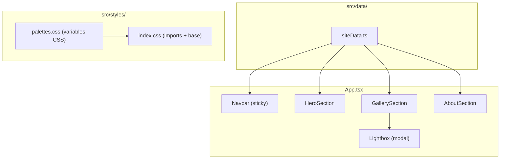

# Documento de Diseño — Photographer Portfolio

## Overview

Este documento describe el diseño técnico del portafolio web de Nicolás Restrepo, fotógrafo de viajes. El sitio es una Single Page Application (SPA) estática construida con React + Vite + Tailwind CSS + TypeScript, desplegada en Vercel.

La arquitectura prioriza:
- **Inmersión visual**: diseño oscuro, fotografías protagonistas, tipografía limpia.
- **Datos centralizados**: todo el contenido en un único archivo TypeScript editable.
- **Paletas intercambiables**: sistema de variables CSS para cambio de color sin tocar componentes.
- **Responsividad**: grid adaptativo 1/2/3 columnas según viewport.

Esta es la **Fase 1 (Visual First)**: frontend estático con datos mock (fotos de Unsplash, categorías en TS, bio placeholder).

---

## Architecture

### Diagrama de Componentes



### Decisiones de Arquitectura

| Decisión | Justificación |
|----------|---------------|
| SPA sin router | Es un one-pager con scroll; no necesita rutas |
| Un archivo de datos TS | Centralización, tipado fuerte, editable sin tocar componentes |
| Variables CSS para paletas | Cascada nativa, sin JS runtime para theming |
| Tailwind v4 con @theme | Consistente con portafolio_tama, permite tokens de diseño vía CSS |
| Vitest + fast-check | Mismo stack de testing que proyectos de referencia |
| Sin framer-motion inicialmente | Fase 1 prioriza contenido; animaciones se agregan en Fase 2 |

---

## Components and Interfaces

### Árbol de Componentes

```
App
├── Navbar
├── HeroSection
├── GallerySection
│   ├── CategoryFilter
│   └── PhotoGrid
│       └── PhotoCard
├── Lightbox
└── AboutSection
    └── SocialLinks
```

### Descripción de Componentes

#### `App.tsx`
- Componente raíz. Renderiza las secciones en orden vertical.
- Gestiona el estado global del Lightbox (abierto/cerrado, foto activa).

#### `Navbar`
- Barra de navegación fija (`position: sticky; top: 0`).
- Enlaces a cada sección vía `scrollIntoView({ behavior: 'smooth' })`.
- Detecta sección activa con `IntersectionObserver`.
- En mobile (<768px): formato hamburguesa compacto.

#### `HeroSection`
- Ocupa 100vw × 100vh.
- Imagen de fondo con `object-fit: cover`.
- Overlay con nombre y subtítulo desde `siteData`.
- Fallback: si la imagen falla, muestra fondo oscuro de la paleta.

#### `GallerySection`
- Contiene `CategoryFilter` y `PhotoGrid`.
- Estado local: `activeCategory` (default: `'all'`).

#### `CategoryFilter`
- Botones renderizados dinámicamente desde las categorías del `siteData`.
- Botón "Todas" siempre primero.
- Estilo activo diferenciado vía clase condicional.

#### `PhotoGrid`
- Grid CSS responsivo: `grid-template-columns` con media queries Tailwind.
  - `grid-cols-1` (< 768px)
  - `md:grid-cols-2` (768px–1024px)
  - `lg:grid-cols-3` (> 1024px)
- Filtra fotos por categoría activa.
- Al hacer clic en una foto, abre el Lightbox.

#### `PhotoCard`
- Imagen con `aspect-ratio` preservado (`object-fit: cover` con altura fija o `aspect-ratio: auto`).
- Título opcional en hover.

#### `Lightbox`
- Modal fullscreen con backdrop oscuro semi-transparente.
- Imagen centrada, escalada con `object-fit: contain` + `max-width/max-height` del viewport.
- Navegación cíclica (prev/next).
- Cierre: botón ×, tecla Escape, clic fuera de la imagen.
- Navegación por teclado: ← →.
- `body.style.overflow = 'hidden'` mientras está abierto.

#### `AboutSection`
- Biografía (máximo 500 caracteres) desde `siteData`.
- Lista de enlaces a redes sociales con `target="_blank" rel="noopener noreferrer"`.
- Si la bio está vacía, oculta el bloque sin espacios residuales.

#### `SocialLinks`
- Componente que mapea el array de redes sociales del `siteData`.
- Cada enlace muestra el nombre de la plataforma como texto.

---

## Data Models

### Interfaces TypeScript (`src/data/types.ts`)

```typescript
/** Categoría temática de fotografías */
export interface Category {
  id: string;
  name: string;
}

/** Fotografía individual */
export interface Photo {
  id: string;
  url: string;
  title: string;
  categoryId: string; // Referencia a Category.id
}

/** Datos del Hero */
export interface HeroData {
  name: string;
  subtitle: string;
  backgroundUrl: string;
}

/** Red social */
export interface SocialLink {
  platform: string;
  url: string;
}

/** Datos de la sección About */
export interface AboutData {
  bio: string;
  socialLinks: SocialLink[];
}

/** Estructura completa del archivo de datos */
export interface SiteData {
  hero: HeroData;
  categories: Category[];
  photos: Photo[];
  about: AboutData;
}
```

### Archivo de Datos (`src/data/siteData.ts`)

```typescript
import type { SiteData } from './types';

export const siteData: SiteData = {
  hero: {
    name: 'Nicolás Restrepo',
    subtitle: 'Fotografía de Viajes',
    backgroundUrl: 'https://images.unsplash.com/photo-...',
  },
  categories: [
    { id: 'landscapes', name: 'Paisajes' },
    { id: 'portraits', name: 'Retratos' },
    { id: 'urban', name: 'Urbano' },
    { id: 'travel', name: 'Viajes' },
  ],
  photos: [
    { id: '1', url: 'https://images.unsplash.com/...', title: 'Amanecer en los Andes', categoryId: 'landscapes' },
    // ... más fotos
  ],
  about: {
    bio: 'Fotógrafo colombiano apasionado por capturar la esencia de los lugares...',
    socialLinks: [
      { platform: 'Instagram', url: 'https://instagram.com/nicorestrepo' },
      { platform: 'Behance', url: 'https://behance.net/nicorestrepo' },
    ],
  },
};
```

### Sistema de Paletas CSS (`src/styles/palettes.css`)

```css
:root {
  /* === PALETA ACTIVA: Dark Classic === */
  --color-bg-primary: #0a0a0a;
  --color-bg-secondary: #1a1a1a;
  --color-text-primary: #f5f5f5;
  --color-accent: #d4af37;

  /* === Warm Cream (descomentar para activar) ===
  --color-bg-primary: #fdf8f0;
  --color-bg-secondary: #f5ede0;
  --color-text-primary: #2d2d2d;
  --color-accent: #c9956b;
  */

  /* === Neutral Gray (descomentar para activar) ===
  --color-bg-primary: #2a2a2a;
  --color-bg-secondary: #3a3a3a;
  --color-text-primary: #e0e0e0;
  --color-accent: #c2b280;
  */

  /* === Clean White (descomentar para activar) ===
  --color-bg-primary: #ffffff;
  --color-bg-secondary: #f8f8f8;
  --color-text-primary: #1a1a1a;
  --color-accent: #333333;
  */
}
```

### Integración con Tailwind (`src/index.css`)

```css
@import "tailwindcss";
@import "./styles/palettes.css";

@theme {
  --color-bg-primary: var(--color-bg-primary);
  --color-bg-secondary: var(--color-bg-secondary);
  --color-text-primary: var(--color-text-primary);
  --color-accent: var(--color-accent);

  --font-display: "Inter", sans-serif;
  --font-body: "Inter", sans-serif;
}

@layer base {
  html {
    font-family: var(--font-body);
    background-color: var(--color-bg-primary);
    color: var(--color-text-primary);
  }

  body {
    margin: 0;
    min-height: 100svh;
    -webkit-font-smoothing: antialiased;
    -moz-osx-font-smoothing: grayscale;
  }
}
```

### Configuración Vercel (`vercel.json`)

```json
{
  "rewrites": [
    { "source": "/(.*)", "destination": "/index.html" }
  ]
}
```

---


## Correctness Properties

*Una propiedad es una característica o comportamiento que debe mantenerse verdadero en todas las ejecuciones válidas de un sistema — esencialmente, una declaración formal sobre lo que el sistema debe hacer. Las propiedades sirven como puente entre especificaciones legibles por humanos y garantías de correctitud verificables por máquina.*

### Property 1: Filtrado de galería retorna exactamente las fotos correspondientes

*Para cualquier* array de fotos y *para cualquier* categoría seleccionada (incluyendo "all"), las fotos visibles deben ser exactamente: todas las fotos si la categoría es "all", o solo las fotos cuyo `categoryId` coincide con la categoría seleccionada en caso contrario. Además, los controles de filtro deben incluir "Todas" como primera opción seguida de todas las categorías definidas.

**Validates: Requirements 2.2, 2.3, 2.4**

### Property 2: Navegación cíclica del lightbox

*Para cualquier* lista de N fotos (N ≥ 1) y *para cualquier* índice actual i (0 ≤ i < N), navegar "siguiente" debe producir el índice `(i + 1) % N`, y navegar "anterior" debe producir el índice `(i - 1 + N) % N`.

**Validates: Requirements 3.2, 3.6**

### Property 3: Click en foto abre lightbox con la foto correcta

*Para cualquier* foto visible en el grid activo, al activar la apertura del lightbox con esa foto, el lightbox debe mostrar exactamente la misma foto (mismo id y URL) que fue seleccionada.

**Validates: Requirements 3.1**

### Property 4: Biografía no excede el límite de caracteres

*Para cualquier* string de biografía almacenada en el archivo de datos, el texto renderizado en la sección About no debe exceder 500 caracteres.

**Validates: Requirements 4.1**

### Property 5: Enlaces de redes sociales abren en nueva pestaña

*Para cualquier* array de redes sociales definidas en el archivo de datos, cada enlace renderizado debe tener el atributo `target="_blank"` y `rel` conteniendo "noopener".

**Validates: Requirements 4.2, 4.3**

### Property 6: Integridad referencial de datos del sitio

*Para cualquier* instancia válida de `SiteData`: (a) todos los `Category.id` deben ser únicos y no vacíos, (b) todas las fotos deben tener `id`, `url`, `title` y `categoryId` no vacíos con `id` únicos, y (c) cada `Photo.categoryId` debe corresponder a un `Category.id` existente en el array de categorías.

**Validates: Requirements 6.1, 6.2, 6.6**

---

## Error Handling

| Escenario | Comportamiento |
|-----------|----------------|
| Imagen del Hero no carga | `onError` en ``: ocultar imagen, mostrar fondo oscuro de paleta |
| Categoría sin fotos | Mostrar mensaje "No hay fotografías en esta categoría" centrado en el grid |
| Bio vacía o undefined | Ocultar bloque de biografía completamente (no renderizar el `<p>`) |
| Array de redes sociales vacío | No renderizar la sección de enlaces sociales |
| Foto sin URL válida en galería | Ocultar la foto individual del grid (no romper el layout) |
| Lightbox sin fotos (edge) | No abrir el lightbox si no hay fotos en el grid activo |

---

## Testing Strategy

### Stack de Testing

- **Framework**: Vitest (consistente con proyectos de referencia)
- **Testing Library**: @testing-library/react para tests de componentes
- **Property-Based Testing**: fast-check (ya usado en portafolio_tama y Portafolio_vale)
- **Entorno DOM**: jsdom

### Tests Unitarios (Example-Based)

Cubren comportamientos específicos y casos edge:
- Hero renderiza nombre, subtítulo y foto desde siteData
- Hero muestra fallback cuando imagen falla
- Galería muestra filtros con "Todas" seleccionada por defecto
- Categoría vacía muestra mensaje de vacío
- Lightbox se cierra con Escape, clic fuera, y botón ×
- Lightbox bloquea scroll del body
- About oculta bio cuando está vacía
- Navbar es sticky y contiene enlaces a las 3 secciones
- Smooth scroll se ejecuta al hacer clic en enlace de navbar
- Grid tiene clases responsivas correctas (1/2/3 columnas)
- vercel.json contiene rewrite correcto

### Tests de Propiedad (Property-Based)

Cada propiedad se implementa como un test con fast-check, mínimo 100 iteraciones:

| Test | Propiedad del Diseño | Tag |
|------|---------------------|-----|
| Filtrado retorna fotos correctas | Property 1 | `Feature: photographer-portfolio, Property 1: Filtrado de galería` |
| Navegación cíclica modular | Property 2 | `Feature: photographer-portfolio, Property 2: Navegación cíclica` |
| Apertura lightbox con foto correcta | Property 3 | `Feature: photographer-portfolio, Property 3: Apertura lightbox` |
| Bio no excede 500 chars | Property 4 | `Feature: photographer-portfolio, Property 4: Límite biografía` |
| Redes sociales con target _blank | Property 5 | `Feature: photographer-portfolio, Property 5: Redes en nueva pestaña` |
| Integridad referencial de datos | Property 6 | `Feature: photographer-portfolio, Property 6: Integridad de datos` |

### Configuración

```typescript
// vitest.config.ts
export default defineConfig({
  plugins: [react(), tailwindcss()],
  test: {
    globals: true,
    environment: 'jsdom',
    setupFiles: ['./src/test/setup.ts'],
  },
});
```

### Estructura de Archivos de Test

```
src/
├── __tests__/
│   ├── components/
│   │   ├── HeroSection.test.tsx
│   │   ├── GallerySection.test.tsx
│   │   ├── Lightbox.test.tsx
│   │   ├── AboutSection.test.tsx
│   │   └── Navbar.test.tsx
│   └── properties/
│       ├── gallery-filter.property.test.ts
│       ├── lightbox-navigation.property.test.ts
│       ├── lightbox-open.property.test.ts
│       ├── about-bio-limit.property.test.ts
│       ├── social-links.property.test.ts
│       └── data-integrity.property.test.ts
└── test/
    └── setup.ts
```
