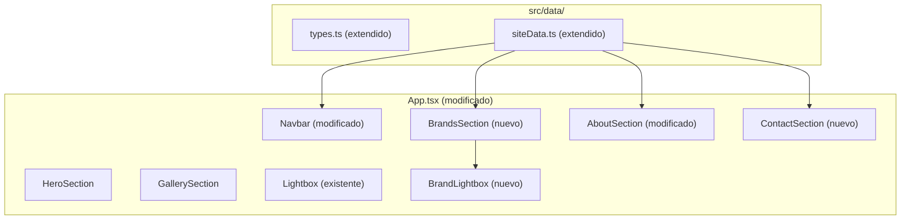

# Design Document — Portfolio Additions

## Overview

Este documento describe el diseño técnico de tres nuevas adiciones al portafolio existente de Nicolás Restrepo:

1. **Foto del fotógrafo** en la sección About (layout responsivo con fallback)
2. **Sección de Contacto** con formulario visual (sin backend en Fase 1)
3. **Sección de Marcas** con carrusel marquee de logos + grid de tarjetas + lightbox por marca

Las adiciones se integran con la arquitectura existente: datos centralizados en `siteData.ts`, sistema de paletas CSS, y componentes React con Tailwind. Se reutiliza el Lightbox existente como base para el Lightbox de marcas.

---

## Architecture

### Diagrama de Componentes (Nuevos + Modificados)



### Decisiones de Arquitectura

| Decisión | Justificación |
|----------|---------------|
| Reutilizar el patrón Lightbox existente | El lightbox de marcas tiene la misma mecánica (navegación cíclica, teclado, backdrop). Se crea un componente `BrandLightbox` que recibe `photos: string[]` + `brandName` |
| Campos opcionales en `SiteData` | `brands?` y `contact?` permiten que el portafolio funcione sin datos de marcas/contacto sin errores de tipo |
| Marquee con CSS animation | Sin dependencias JS adicionales; `@keyframes scroll` con `translateX` y duplicación de nodos para loop infinito |
| Formulario sin handler real | `e.preventDefault()` en el submit; se prepara para Formspree/EmailJS en Fase 2 |
| Orden de secciones: Hero → Galería → Marcas → About → Contacto | Las fotos primero (galería), luego credibilidad (marcas), luego persona (about), luego acción (contacto) |

---

## Components and Interfaces

### Árbol de Componentes (actualizado)

```
App (modificado)
├── Navbar (modificado: nuevos links Marcas, Contacto)
├── HeroSection
├── GallerySection
│   ├── CategoryFilter
│   └── PhotoGrid → PhotoCard
├── BrandsSection (nuevo)
│   ├── BrandMarquee
│   └── BrandGrid
│       └── BrandCard
├── AboutSection (modificado: + foto del fotógrafo)
│   └── SocialLinks
├── ContactSection (nuevo)
│   └── ContactForm
├── Lightbox (existente, para galería)
└── BrandLightbox (nuevo, para marcas)
```

### Componentes Nuevos

#### `BrandsSection` (`src/components/BrandsSection.tsx`)
- Renderiza `BrandMarquee` + `BrandGrid`.
- Si `siteData.brands` es undefined o vacío, retorna `null` (no renderiza nada).
- Gestiona estado del `BrandLightbox` (marca seleccionada, abierto/cerrado).

#### `BrandMarquee` (`src/components/BrandMarquee.tsx`)
- Carrusel horizontal auto-scroll con CSS `@keyframes`.
- Duplica el array de logos para crear loop infinito.
- Cada logo: `` con `height: 48px`, `object-fit: contain`.
- Pausa la animación en `:hover` vía `animation-play-state: paused`.
- Usa `overflow: hidden` en el contenedor.

#### `BrandGrid` (`src/components/BrandGrid.tsx`)
- Grid responsivo: `grid-cols-1 md:grid-cols-2 lg:grid-cols-3`.
- Renderiza un `BrandCard` por cada marca.

#### `BrandCard` (`src/components/BrandCard.tsx`)
- Props: `brand: Brand`, `onClick: () => void`.
- Muestra: logo (32px altura, arriba), foto de portada (imagen principal), nombre de la marca.
- Si `brand.photos.length === 0`, deshabilita el click (no pointer, opacidad reducida).
- Colores desde variables de paleta.

#### `BrandLightbox` (`src/components/BrandLightbox.tsx`)
- Similar al Lightbox existente pero recibe:
  - `photos: string[]` (URLs directas, no objetos Photo)
  - `brandName: string` (se muestra como título)
  - `isOpen: boolean`
  - `onClose: () => void`
- Navegación cíclica, teclado (←, →, Escape), clic fuera, bloqueo de scroll.
- Muestra nombre de marca como título sobre la imagen.

#### `ContactSection` (`src/components/ContactSection.tsx`)
- Título desde `siteData.contact?.title` o fallback "Contacto".
- Renderiza `ContactForm`.

#### `ContactForm` (`src/components/ContactForm.tsx`)
- Campos: nombre (`<input type="text">`), email (`<input type="email">`), mensaje (`<textarea>`).
- Todos con `required`.
- Botón "Enviar" con `e.preventDefault()` en el submit.
- Colores de paleta en inputs, bordes, botón.
- Desktop: max-width centrado. Mobile: full width.

### Componentes Modificados

#### `AboutSection` (modificado)
- Agrega `` con `siteData.about.photographerPhotoUrl`.
- Layout: `md:flex md:gap-8` (dos columnas en desktop), columna única en mobile.
- Foto a la izquierda, bio + redes a la derecha.
- `onError` en la imagen: `setShowPhoto(false)` para ocultar sin espacios.
- Si `photographerPhotoUrl` es vacío/undefined: no renderiza la imagen, usa layout centrado.

#### `Navbar` (modificado)
- Agregar links: `{ label: 'Marcas', targetId: 'brands' }` y `{ label: 'Contacto', targetId: 'contact' }`.
- Links condicionales: "Marcas" solo aparece si `siteData.brands?.length > 0`.
- `IntersectionObserver` observa las nuevas secciones.

#### `App.tsx` (modificado)
- Importar y renderizar `BrandsSection` y `ContactSection`.
- Gestionar estado del `BrandLightbox`.
- Orden: Navbar → Hero → Gallery → Brands → About → Contact → Lightbox → BrandLightbox.

---

## Data Models

### Interfaces TypeScript Nuevas/Extendidas (`src/data/types.ts`)

```typescript
/** Marca/cliente con la que el fotógrafo ha trabajado */
export interface Brand {
  id: string;
  name: string;
  logoUrl: string;
  coverPhotoUrl: string;
  photos: string[]; // URLs de fotos del proyecto
}

/** Datos de la sección de contacto */
export interface ContactData {
  title: string;
  subtitle?: string;
}

/** Datos de la sección About (extendida) */
export interface AboutData {
  bio: string;
  photographerPhotoUrl?: string; // NUEVO: foto del fotógrafo
  socialLinks: SocialLink[];
}

/** Estructura completa del archivo de datos (extendida) */
export interface SiteData {
  hero: HeroData;
  categories: Category[];
  photos: Photo[];
  about: AboutData;
  brands?: Brand[];      // NUEVO: opcional
  contact?: ContactData; // NUEVO: opcional
}
```

### Datos Mock para Marcas (`siteData.ts` extendido)

```typescript
brands: [
  {
    id: 'brand-nike',
    name: 'Nike',
    logoUrl: 'https://upload.wikimedia.org/wikipedia/commons/thumb/a/a6/Logo_NIKE.svg/200px-Logo_NIKE.svg.png',
    coverPhotoUrl: 'https://images.unsplash.com/photo-1542291026-7eec264c27ff?w=800',
    photos: [
      'https://images.unsplash.com/photo-1542291026-7eec264c27ff?w=1200',
      'https://images.unsplash.com/photo-1606107557195-0e29a4b5b4aa?w=1200',
      'https://images.unsplash.com/photo-1600185365926-3a2ce3cdb9eb?w=1200',
    ],
  },
  // ... más marcas
],
contact: {
  title: 'Contacto',
  subtitle: '¿Tienes un proyecto en mente? Escríbeme.',
},
```

### CSS del Marquee (`src/styles/marquee.css`)

```css
@keyframes marquee-scroll {
  0% {
    transform: translateX(0);
  }
  100% {
    transform: translateX(-50%);
  }
}

.marquee-track {
  display: flex;
  width: max-content;
  animation: marquee-scroll 30s linear infinite;
}

.marquee-track:hover {
  animation-play-state: paused;
}
```

---

## Correctness Properties

### Property 1: Marcas vacías ocultan la sección completa

*Para cualquier* estado de `siteData.brands` que sea `undefined`, `null`, o un array vacío `[]`, la Sección_Marcas no debe renderizar ningún elemento DOM (incluyendo carrusel y grid), y el enlace "Marcas" no debe aparecer en la Navbar.

**Validates: Requirements 3.6, 8.5**

### Property 2: Navegación cíclica del lightbox de marca

*Para cualquier* array de N fotos (N ≥ 1) de una marca y *para cualquier* índice actual i (0 ≤ i < N), navegar "siguiente" debe producir el índice `(i + 1) % N`, y navegar "anterior" debe producir el índice `(i - 1 + N) % N`. Idéntica a la propiedad del lightbox principal.

**Validates: Requirements 5.2, 5.6**

### Property 3: Tarjeta de marca con photos vacío no abre lightbox

*Para cualquier* marca cuyo array `photos` es vacío (`[]`), hacer clic en la tarjeta no debe abrir el lightbox ni cambiar ningún estado visible.

**Validates: Requirements 4.5, 5.9**

### Property 4: Formulario previene envío

*Para cualquier* estado del formulario de contacto, al disparar el evento submit, el comportamiento por defecto del formulario (navegación/recarga) debe ser prevenido. No debe haber ninguna solicitud de red.

**Validates: Requirements 2.6**

### Property 5: Foto del fotógrafo ausente no rompe layout

*Para cualquier* valor de `photographerPhotoUrl` que sea `undefined`, `""`, o `null`, la sección About debe renderizar la biografía sin el contenedor de imagen y sin espacios residuales.

**Validates: Requirements 1.5, 1.6**

---

## Error Handling

| Escenario | Comportamiento |
|-----------|----------------|
| `photographerPhotoUrl` vacío o undefined | No renderizar ``, layout single-column |
| Foto del fotógrafo falla al cargar | `onError`: ocultar imagen, colapsar espacio |
| `brands` undefined o array vacío | `BrandsSection` retorna `null`; Navbar oculta enlace "Marcas" |
| Logo de marca falla al cargar | Mostrar placeholder con nombre de la marca |
| Foto de portada de marca falla | Mostrar placeholder con nombre |
| `brand.photos` vacío | Deshabilitar click en tarjeta, no abrir lightbox |
| `contact` undefined | Sección contacto usa textos por defecto |
| Submit del formulario | `e.preventDefault()` siempre |

---

## Testing Strategy

### Tests Unitarios Nuevos

| Test | Componente | Validación |
|------|-----------|------------|
| About muestra foto cuando URL existe | AboutSection | Imagen renderiza con src correcto |
| About oculta foto cuando URL vacía | AboutSection | No hay `` en el DOM |
| About oculta foto cuando onError | AboutSection | Imagen desaparece tras error |
| Marcas se oculta con brands vacío | BrandsSection | Componente retorna null |
| Marquee duplica logos | BrandMarquee | DOM tiene 2× la cantidad de logos |
| BrandCard deshabilita click con photos vacío | BrandCard | onClick no se dispara |
| BrandLightbox navega cíclicamente | BrandLightbox | Índice correcto tras next/prev |
| BrandLightbox se cierra con Escape | BrandLightbox | onClose se llama |
| Formulario previene submit | ContactForm | No hay recarga, preventDefault llamado |
| Formulario tiene campos required | ContactForm | Todos los inputs con required |
| Navbar muestra/oculta link Marcas | Navbar | Condicional basado en brands |

### Tests de Propiedad (Property-Based)

| Test | Propiedad | Tag |
|------|-----------|-----|
| Brands vacíos → sección oculta | Property 1 | `Feature: portfolio-additions, Property 1` |
| Navegación cíclica lightbox marca | Property 2 | `Feature: portfolio-additions, Property 2` |
| Photos vacío → no abre lightbox | Property 3 | `Feature: portfolio-additions, Property 3` |
| Submit siempre prevenido | Property 4 | `Feature: portfolio-additions, Property 4` |
| Foto ausente → layout correcto | Property 5 | `Feature: portfolio-additions, Property 5` |

### Estructura de Archivos de Test

```
src/__tests__/
├── components/
│   ├── AboutSection.additions.test.tsx
│   ├── BrandsSection.test.tsx
│   ├── BrandMarquee.test.tsx
│   ├── BrandCard.test.tsx
│   ├── BrandLightbox.test.tsx
│   ├── ContactSection.test.tsx
│   └── Navbar.additions.test.tsx
└── properties/
    ├── brands-visibility.property.test.ts
    ├── brand-lightbox-navigation.property.test.ts
    ├── brand-card-disabled.property.test.ts
    ├── contact-form-submit.property.test.ts
    └── about-photo-fallback.property.test.ts
```
