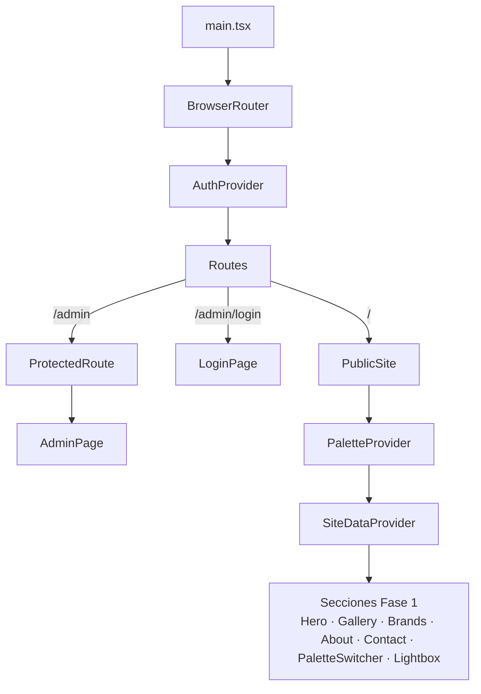
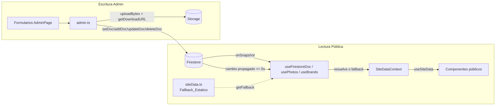

# Design Document

## Overview

La Fase 2 convierte el portafolio estático de Nicolás Restrepo (Fase 1: React 19 + Vite + Tailwind v4 + TypeScript) en un sitio administrable respaldado por Firebase, **sin servidor propio ni Cloud Functions**. Toda la lógica vive en el cliente mediante el SDK web modular de Firebase (`firebase` v12).

El diseño persigue tres objetivos:

1. **Administración privada.** Nicolás inicia sesión (Firebase Auth email/password) y gestiona todo el contenido —Hero, fotos, categorías, About, marcas, contacto y estilos de galería— desde un panel protegido en `/admin`.
2. **Lectura pública en tiempo real con respaldo.** Los visitantes ven el contenido leído desde Firestore vía `onSnapshot`, y el sitio nunca aparece vacío: cuando un origen no existe, está vacío o falla, se aplica el `Fallback_Estatico` de `src/data/siteData.ts`.
3. **Compatibilidad total con la Fase 1.** Los componentes públicos existentes se conservan, se refactorizan para consumir un contexto de datos en vez de importar `siteData` directamente, y los tipos de `src/data/types.ts` solo se extienden de forma aditiva. La suite de pruebas de la Fase 1 debe seguir pasando al 100%.

El enfoque replica el patrón validado del proyecto de referencia `portafolio_tama`: inicialización idempotente de Firebase, contextos de autenticación y datos, hooks de lectura reactivos con fallback, una capa de servicio de escritura (`admin.ts`), enrutamiento con rutas admin separadas del layout público, formulario de contacto con EmailJS, y un script de seed idempotente.

Este diseño cubre los 15 requisitos del documento de requisitos y es trazable a sus criterios de aceptación EARS. El Requisito 15 introduce el **Editor_Galeria**: una vista unificada del Panel_Admin que combina la gestión de Fotos, los controles del Estilo_Galeria y un Preview_Galeria en vivo, con reordenamiento de Fotos por arrastre y persistencia del orden global (`order`) y por categoría (`categoryOrder`).

### Dependencias nuevas

| Paquete | Tipo | Uso |
|---|---|---|
| `firebase` (v12) | dependencia | Auth, Firestore, Storage (SDK web modular) |
| `react-router-dom` (v7) | dependencia | Separación de rutas públicas y admin |
| `@emailjs/browser` | dependencia | Envío del formulario de contacto |
| `@dnd-kit/core` | dependencia | Contexto de arrastre (`DndContext`, sensores) para reordenar Fotos en el Editor_Galeria (Req 15.6) |
| `@dnd-kit/sortable` | dependencia | Lista ordenable (`SortableContext`, `useSortable`, `arrayMove`) para el reordenamiento por arrastre |
| `@dnd-kit/utilities` | dependencia | Utilidades de estilo/transform (`CSS.Transform`) para los ítems arrastrables |
| `tsx` | devDependencia | Ejecutar el script de seed en Node/TypeScript |

## Architecture

### Árbol de providers y enrutamiento

La raíz de la aplicación envuelve todo en `BrowserRouter` y `AuthProvider`. El `SiteDataProvider` y el `PaletteProvider` solo envuelven el layout público, de modo que el Panel_Admin se renderiza sin el layout de la Fase 1 (Req 3.6) y el sitio público conserva su layout en `/` (Req 3.7).



### Flujo de datos

Dos flujos claramente separados: **lectura pública** (reactiva, con fallback) y **escritura admin** (imperativa, vía capa de servicio).



Cuando el Admin escribe un cambio (por ejemplo, guarda el Hero), Firestore propaga el cambio a las suscripciones `onSnapshot` activas, y el sitio público refleja el cambio en la interfaz sin recarga manual (Req 4.2, 11.7).

### Tabla de decisiones de arquitectura

| Decisión | Alternativa descartada | Justificación |
|---|---|---|
| Firebase 100% cliente (Auth + Firestore + Storage) | Servidor propio / Cloud Functions | Sitio de un solo administrador; el SDK cliente cubre CRUD y subidas. Menor costo operativo y despliegue estático en Vercel. Replica `portafolio_tama`. |
| Inicialización idempotente con `getApps()`/`getApp()` | `initializeApp` directo | Evita reinicializar Firebase durante el HMR de Vite (Req 1.2, 1.4). |
| `onSnapshot` para lectura pública | Lectura única (`getDoc`) | Cumple el requisito de tiempo real (Req 4.1, 4.2): los cambios del Admin se ven sin recargar. |
| `SiteDataProvider` que bloquea el render hasta la primera respuesta de todos los orígenes | Renderizar fallback inmediato | Evita el "flash de fallback" (Req 4.5, 4.6): mientras carga se muestra un spinner. |
| Hook factory genérico `useFirestoreDoc({ path, getFallback, isEmpty })` | Un hook por documento | Reutilización, contrato uniforme de fallback, y `isEmpty` inyectable (Req 4.3, 4.4). |
| Capa de servicio `admin.ts` separada de la UI | Escrituras dispersas en componentes | Centraliza validación, limpieza de `undefined`, orquestación subida→escritura y manejo de errores (Req 5–11). |
| Colecciones multi-documento (`photos`, `brands`) con `id = doc.id` | Arreglos dentro de un singleton | Escala mejor para listas y permite CRUD por documento (Req 5, 9). |
| Documentos singleton para contenido único (Hero, About, Contact, categories, gallery-style) | Colecciones | Contenido único; `setDoc` con `merge` es simple y atómico (Req 7, 8, 10, 11). |
| Rutas admin fuera del layout público | Panel embebido en la SPA | Separación de layouts y protección de rutas limpia (Req 3.6, 3.7). |
| Extensión aditiva de tipos (`galleryStyle?`) | Modificar tipos existentes | Mantiene la compilación de la Fase 1 sin cambios (Req 14.5, 14.6). |
| `style` inline para gap/border-radius de la galería | Clases Tailwind dinámicas | Tailwind no detecta clases construidas dinámicamente; el gap es un valor en px arbitrario (Req 11.7). |
| Seed con IDs deterministas (`doc(col, photo.id)` + `setDoc`) | `addDoc` (IDs aleatorios) | Garantiza idempotencia: re-ejecutar no duplica (Req 13.6). |
| EmailJS en el cliente | Endpoint de correo propio | Sin backend; alineado con la arquitectura sin servidor (Req 12). |

## Components and Interfaces

### Árbol de componentes

```
main.tsx
└── BrowserRouter
    └── AuthProvider (contexts/AuthContext)
        └── Routes
            ├── "/"  PublicSite
            │   └── PaletteProvider (context/PaletteContext)  [Fase 1, conservado]
            │       └── SiteDataProvider (contexts/SiteDataContext)
            │           ├── Navbar
            │           ├── HeroSection        → useSiteData()
            │           ├── GallerySection     → useSiteData()  (CategoryFilter, PhotoGrid → PhotoCard)
            │           ├── BrandsSection       → useSiteData()  (BrandMarquee)
            │           ├── AboutSection        → useSiteData()  (SocialLinks)
            │           ├── ContactSection      → useSiteData()  (ContactForm → EmailJS)
            │           ├── Lightbox
            │           └── PaletteSwitcher     [Fase 1, conservado]
            ├── "/admin/login"  LoginPage       → useAuth()
            └── "/admin"  ProtectedRoute → AdminPage
                └── AdminPage (tabs)
                    ├── admin/GalleryEditor  (pestaña "Galería" unificada: Fotos + Estilo_Galeria + Preview)
                    │   ├── admin/PhotoForm + admin/PhotoList  (gestión CRUD de fotos)
                    │   ├── admin/GalleryStyleForm  (o sus controles: gap 0–64 + esquinas)
                    │   └── Preview_Galeria en vivo  (reusa PhotoGrid → PhotoCard)
                    ├── admin/CategoriesEditor
                    ├── admin/HeroForm
                    ├── admin/AboutForm
                    ├── admin/BrandForm + admin/BrandList
                    └── admin/ContactForm  (admin, distinto del público)
```

### Módulos nuevos

#### `src/lib/firebase.ts` — Firebase_Init (Req 1)

Inicializa Firebase una sola vez y exporta singletons. Idempotente frente a HMR.

```typescript
import { initializeApp, getApps, getApp } from 'firebase/app';
import { getAuth } from 'firebase/auth';
import { getFirestore } from 'firebase/firestore';
import { getStorage } from 'firebase/storage';

const REQUIRED_VARS = [
  'VITE_FIREBASE_API_KEY',
  'VITE_FIREBASE_AUTH_DOMAIN',
  'VITE_FIREBASE_PROJECT_ID',
  'VITE_FIREBASE_STORAGE_BUCKET',
  'VITE_FIREBASE_MESSAGING_SENDER_ID',
  'VITE_FIREBASE_APP_ID',
] as const;

/** Función pura testeable: devuelve los nombres de variables ausentes o vacías (Req 1.6). */
export function findMissingConfigVars(
  env: Record<string, string | undefined>,
): string[] {
  return REQUIRED_VARS.filter((name) => {
    const v = env[name];
    return v === undefined || v.trim() === '';
  });
}

const firebaseConfig = {
  apiKey: import.meta.env.VITE_FIREBASE_API_KEY ?? '',
  authDomain: import.meta.env.VITE_FIREBASE_AUTH_DOMAIN ?? '',
  projectId: import.meta.env.VITE_FIREBASE_PROJECT_ID ?? '',
  storageBucket: import.meta.env.VITE_FIREBASE_STORAGE_BUCKET ?? '',
  messagingSenderId: import.meta.env.VITE_FIREBASE_MESSAGING_SENDER_ID ?? '',
  appId: import.meta.env.VITE_FIREBASE_APP_ID ?? '',
};

const missing = findMissingConfigVars(import.meta.env as Record<string, string | undefined>);
if (missing.length > 0) {
  console.error(
    `[firebase] Faltan variables de entorno requeridas: ${missing.join(', ')}`,
  );
}

// Idempotencia: reutiliza la app existente si ya fue inicializada (Req 1.2, 1.4).
const app = getApps().length ? getApp() : initializeApp(firebaseConfig);

export const auth = getAuth(app);
export const db = getFirestore(app);
export const storage = getStorage(app);
```

- Config desde `import.meta.env.VITE_FIREBASE_*` con fallback `''` (Req 1.1).
- `findMissingConfigVars` es una función pura extraída para poder testearla (Req 1.6) sin depender del entorno de Vite.

#### `src/contexts/AuthContext.tsx` — Auth_Context (Req 2)

```typescript
interface AuthContextValue {
  user: User | null;
  loading: boolean;
  login: (email: string, password: string) => Promise<void>;
  logout: () => Promise<void>;
}
```

- `AuthProvider` se suscribe con `onAuthStateChanged(auth, ...)` y expone `{ user, loading }`; `loading` es `true` hasta la primera emisión (Req 2.7, 3.2).
- `login(email, password)` → `signInWithEmailAndPassword`; `logout()` → `signOut` (Req 2.2, 2.4).
- La persistencia de sesión usa el valor por defecto de Firebase (`local`), conservando la sesión entre recargas (Req 2.8).
- Hook `useAuth()` que lanza error si se usa fuera del provider.
- No existe registro público de cuentas: no se expone ninguna función `signUp` (Req 2.6).

#### `src/lib/loginThrottle.ts` — Limitador de intentos (Req 2.10)

Lógica pura de limitación de intentos, separada de la UI para testearla como propiedad.

```typescript
interface ThrottleState { failures: number[]; } // timestamps (ms) de fallos

export function isLocked(state: ThrottleState, now: number,
  windowMs = 5 * 60_000, maxFailures = 5): boolean;

export function registerFailure(state: ThrottleState, now: number): ThrottleState;
```

- Tras 5 fallos dentro de una ventana de 5 minutos, `isLocked` devuelve `true` y `LoginPage` bloquea nuevos envíos mostrando un mensaje de bloqueo temporal (Req 2.10).

#### `src/components/ProtectedRoute.tsx` — Protected_Route (Req 3)

```typescript
export default function ProtectedRoute({ children }: { children: React.ReactNode }) {
  const { user, loading } = useAuth();
  if (loading) return <Spinner />;              // Req 3.2
  if (!user) return <Navigate to="/admin/login" replace />; // Req 3.3
  return <>{children}</>;                        // Req 3.4
}
```

#### `src/pages/LoginPage.tsx` (Req 2, 3.5)

- Formulario email/password. Deshabilita el botón mientras el login está en curso (Req 2.9).
- Credenciales inválidas → mensaje de error, permanece en `/admin/login`, conserva el email introducido (Req 2.3).
- Si ya hay `user`, `Navigate` a `/admin` (Req 3.5).
- Integra `loginThrottle` para el bloqueo tras 5 intentos (Req 2.10).

#### `src/hooks/useFirestoreDoc.ts` — useFirestoreDoc (Req 4)

Hook factory genérico para documentos singleton.

```typescript
interface UseFirestoreDocOptions<T> {
  path: string;                 // p.ej. "site-content/hero"
  getFallback: () => T;         // Fallback_Estatico correspondiente
  isEmpty: (data: unknown) => boolean; // decide si el dato debe tratarse como vacío
}
interface FirestoreDocResult<T> { data: T; loading: boolean; }

export function useFirestoreDoc<T>(opts: UseFirestoreDocOptions<T>): FirestoreDocResult<T>;
```

- Se suscribe con `onSnapshot(doc(db, path))`.
- **Resolución (pura y testeable):** `resolveDoc(snapshotData, isEmpty, getFallback)` devuelve `getFallback()` cuando el doc no existe, está vacío según `isEmpty`, o la lectura inicial falla (Req 4.3); en caso contrario devuelve el dato (Req 4.6).
- Ante un error de una suscripción ya inicializada, conserva el último dato válido (Req 4.7).

#### `src/hooks/usePhotos.ts` y `src/hooks/useBrands.ts` (Req 4, 5.1, 9.7)

- `onSnapshot(collection(db, 'photos'))` y `onSnapshot(collection(db, 'brands'))`.
- Mapean cada documento a la entidad tomando `id = doc.id` (el `id` no se guarda dentro del documento).
- Aplican fallback (colección vacía/inexistente/fallida → `siteData.photos` / `siteData.brands`).

#### `src/contexts/SiteDataContext.tsx` — SiteData_Context (Req 4, 14)

```typescript
interface SiteDataContextValue {
  hero: HeroData;
  categories: Category[];
  photos: Photo[];
  about: AboutData;
  brands: Brand[];
  contact: ContactData;
  galleryStyle: GalleryStyle;
}
```

- `SiteDataProvider` compone `useFirestoreDoc` (hero, about, contact, categories, gallery-style) + `usePhotos` + `useBrands`.
- **Loading global = disyunción de los `loading` individuales**: mientras algún origen no haya emitido su primera respuesta, muestra un spinner en lugar de contenido parcial o de respaldo (Req 4.5). Al recibir todas las primeras respuestas, renderiza el contenido resuelto aplicando fallback solo a los orígenes vacíos/inexistentes/fallidos (Req 4.6).
- `useSiteData()` expone el contenido garantizado (nunca `undefined`).

#### `src/lib/admin.ts` — Admin_Service (Req 5–11)

Capa de escritura. Limpia campos `undefined` antes de escribir (Firestore los rechaza).

```typescript
// Subida
export async function uploadFile(file: File, path: string): Promise<string>; // uploadBytes → getDownloadURL

// Fotos (colección 'photos')  — Req 5
export async function createPhoto(input: PhotoInput): Promise<string>;
export async function updatePhoto(id: string, input: Partial<PhotoInput>): Promise<void>;
export async function deletePhoto(id: string): Promise<void>;

// Reordenamiento de fotos (colección 'photos') — Req 15.7, 15.8
export async function reorderPhotosGlobal(orderedIds: string[]): Promise<void>;
export async function reorderPhotosInCategory(categoryId: string, orderedIds: string[]): Promise<void>;

// Marcas (colección 'brands') — Req 9
export async function createBrand(input: BrandInput): Promise<string>;
export async function updateBrand(id: string, input: Partial<BrandInput>): Promise<void>;
export async function deleteBrand(id: string): Promise<void>;

// Singletons (setDoc merge)   — Req 7, 8, 10, 11, 6
export async function updateHero(data: HeroData): Promise<void>;         // site-content/hero
export async function updateAbout(data: AboutData): Promise<void>;       // profile/main
export async function updateContact(data: ContactData): Promise<void>;   // site-content/contact
export async function updateCategories(cats: Category[]): Promise<void>; // site-config/categories
export async function updateGalleryStyle(s: GalleryStyle): Promise<void>;// site-config/gallery-style

// Utilidades puras testeables
export function stripUndefined<T extends object>(obj: T): Partial<T>;
```

- **Orquestación subida→escritura:** las funciones que suben imagen (Hero, About, Marca, Foto) primero llaman a `uploadFile`; si la subida falla, propagan el error y **no** invocan la escritura del documento (Req 7.8, 8.7, 9.6).
- `createPhoto`/`createBrand` usan `addDoc` (ID autogenerado); `update*`/`delete*` usan `updateDoc`/`deleteDoc` sobre `doc(db, col, id)`.
- Las validaciones de longitud/formato/requeridos viven en módulos de validación puros reutilizados por los formularios (ver abajo), de modo que la capa de servicio solo persiste datos ya validados.

**Orden de las Fotos (`order` / `categoryOrder`) — Req 5.10, 5.11, 5.12, 15.7, 15.8:**

- `createPhoto` asigna, además de `url/title/categoryId/size`, un `order` global y un `categoryOrder` que ubican la nueva Foto **al final** del orden existente. La posición final se calcula contando las Fotos ya existentes (p.ej. `order = photos.length` y `categoryOrder = photos.filter(p => p.categoryId === categoryId).length`) tomando el conteo de la lectura reactiva vigente (Req 5.10).
- `updatePhoto`, cuando el `categoryId` cambia respecto al actual, **reasigna** `categoryOrder` al final de la categoría destino (contando las Fotos de esa categoría), dejando `order` global sin cambios (Req 5.11).
- `reorderPhotosGlobal(orderedIds)` recorre el arreglo ordenado y persiste `order = índice` (0..n-1) para cada Foto usando `writeBatch(db)` para atomicidad: todas las escrituras se aplican o ninguna (Req 15.7). Al reasignar índices contiguos, el orden global queda normalizado.
- `reorderPhotosInCategory(categoryId, orderedIds)` persiste `categoryOrder = índice` (0..n-1) solo sobre las Fotos de esa categoría, también en un `writeBatch` (Req 15.8).
- **Enfoque de contigüidad (Req 5.12):** los índices se normalizan a `0..n-1` en cada reorden (`reorderPhotosGlobal`/`reorderPhotosInCategory`), lo que garantiza un orden contiguo tras cualquier reordenamiento. Tras crear (append) o eliminar una Foto no se exige contigüidad estricta en el almacenamiento: como el render del Sitio_Publico ordena de forma determinista por el campo de orden (ver `sortPhotosByOrder`), los huecos temporales entre índices no producen huecos observables en la galería. Cuando el Admin necesite recompactar explícitamente, un reorden posterior renormaliza los índices. Este enfoque evita escrituras masivas en cada eliminación manteniendo un orden observable contiguo.
- `writeBatch` de `firebase/firestore` se usa para todas las escrituras múltiples de reorden, evitando estados intermedios inconsistentes.

#### `src/lib/validation.ts` — Validadores puros (Req 5, 6, 7, 10, 11, 12)

Funciones puras que devuelven `{ ok: true } | { ok: false; field: string; message: string }`. Reutilizadas por los formularios y testeadas como propiedades.

```typescript
export function validatePhotoInput(input, existingCategoryIds): ValidationResult; // Req 5.2/5.3
export function validateCategory(cat, existingCats, editingId?): ValidationResult; // Req 6.3/6.4
export function validateImageFile(file): ValidationResult;                         // Req 7.2/7.3
export function validateContactContent(title, subtitle): ValidationResult;         // Req 10.3
export function validateGalleryStyle(style): ValidationResult;                      // Req 11.4
export function validateContactMessage(name, email, message): ValidationResult;    // Req 12.2/12.3
```

- `validateImageFile`: acepta solo `image/jpeg | image/png | image/webp` con tamaño ≤ 5 MB (Req 7.2/7.3). Reutilizada por Hero, About y Marcas.
- `validateGalleryStyle`: `gap` entero en `[0, 64]` y `corners ∈ {'square','rounded'}` (Req 11.4).
- `validateContactMessage`: `name` 1–100, `message` 1–2000, `email` con `@`, al menos un carácter antes y un dominio con al menos un punto después (Req 12.2/12.3).

#### `src/pages/AdminPage.tsx` (Req 5–11)

- Dashboard con tabs: `fotos | categorias | hero | about | marcas | contacto | estilos-galeria`.
- Estado local: tab activo, feedback `success`/`error` con auto-dismiss.
- Header muestra `user.email` y un botón "Cerrar sesión" que llama a `logout()` y redirige a `/admin/login` (Req 2.4, 2.5).
- Cada tab renderiza su formulario de `src/components/admin/`.

#### `src/components/admin/GalleryEditor.tsx` — Editor_Galeria (Req 15)

Vista unificada que combina en una sola pantalla la gestión de Fotos, los controles del Estilo_Galeria y un Preview_Galeria en vivo. Es el contenido de la pestaña "Galería" del Panel_Admin.

**Composición y responsabilidades:**

- **Gestión de Fotos:** reutiliza `PhotoForm` (crear/editar/eliminar) y la lista de Fotos existentes. El CRUD sigue delegando en `admin.ts` (Req 15.1).
- **Controles del Estilo_Galeria:** reutiliza `GalleryStyleForm` (o sus controles: `gap` 0–64 y selector de esquinas). Mantiene un **estado local** del estilo (`localStyle`) inicializado desde `useSiteData().galleryStyle`, que representa los valores vigentes en el editor aún no guardados (Req 15.1).
- **Preview_Galeria en vivo:** renderiza el mosaico reutilizando la **misma lógica visual del Sitio_Publico** (reusa `PhotoGrid`/`PhotoCard`, o un componente de preview equivalente que consuma los mismos props) aplicando el `gap` y `corners` **vigentes en el estado local** del editor. Así, al mover los sliders el preview cambia al instante, sin guardar ni recargar (Req 15.2, 15.3).
- **Filtro de categorías en SOLO LECTURA:** muestra las categorías existentes (`useSiteData().categories`) como chips/botones de filtro más una opción "Todas". No expone acciones de crear/editar/eliminar categorías; ese CRUD permanece en `CategoriesEditor` (Req 6). Al elegir una categoría, el preview muestra únicamente sus Fotos ordenadas por `categoryOrder`; en "Todas", muestra todas las Fotos por `order` global (Req 15.4, 15.5).
- **Reordenamiento drag & drop con `@dnd-kit`:** envuelve la lista/preview en `DndContext` + `SortableContext`, y cada Foto usa `useSortable`. Al soltar (`onDragEnd`):
  - En modo "Todas": calcula el nuevo orden con `arrayMove`, actualiza el estado optimista del preview y llama a `reorderPhotosGlobal(orderedIds)` persistiendo el nuevo `order` global (Req 15.6, 15.7).
  - Con una categoría seleccionada: reordena solo las Fotos de esa categoría y llama a `reorderPhotosInCategory(categoryId, orderedIds)` persistiendo `categoryOrder` (Req 15.6, 15.8).
- **Actualización optimista y reversión:** el preview refleja el nuevo orden de inmediato (estado optimista) antes de confirmar la persistencia (Req 15.9). Si la escritura falla, muestra un mensaje de error y **revierte** el preview al último orden persistido (Req 15.10).
- **Selector de tamaño con etiquetas descriptivas + ayuda visual:** define un mapa de metadatos por tamaño que reemplaza las etiquetas planas actuales de `PhotoForm` (Req 5.4):

  ```typescript
  export const PHOTO_SIZE_META: Record<PhotoSize, { label: string; grid: string }> = {
    small:  { label: 'Pequeña (1×1)',              grid: '1×1' },
    medium: { label: 'Mediana (vertical 1×2)',     grid: '1×2' },
    large:  { label: 'Grande (2×2 destacada)',     grid: '2×2' },
    wide:   { label: 'Panorámica (2×1)',           grid: '2×1' },
  };
  ```

  Cada opción muestra la etiqueta legible y un mini-ícono/diagrama que representa cómo ocupa el grid (celdas de un mosaico esquemático).

**Integración con AdminPage (decisión):** se **fusionan** las antiguas pestañas "fotos" y "estilos-galeria" en una **única pestaña "Galería"** que renderiza `GalleryEditor`. Justificación: el estilo y las fotos se editan juntos y el valor del editor está en verlos en un mismo preview en vivo; mantenerlos en pestañas separadas fragmentaría el flujo. El CRUD de categorías permanece en su propia pestaña ("categorias") porque el Editor_Galeria las consume en solo lectura.

#### `src/lib/photoOrder.ts` — Ordenamiento puro de Fotos (Req 15.11, 15.12, 15.13)

Función pura reutilizable por el Sitio_Publico y el Preview_Galeria, extraída para poder testearla como propiedad.

```typescript
import type { Photo } from '../data/types';

/**
 * Ordena las Fotos por su campo de orden según el modo:
 * - 'global'   → por `order` ascendente (galería sin filtro, Req 15.11)
 * - 'category' → por `categoryOrder` ascendente (categoría seleccionada, Req 15.12)
 * Las Fotos sin el campo de orden definido se ubican al final de forma
 * determinista y estable (Req 15.13). No muta la entrada: devuelve una permutación.
 */
export function sortPhotosByOrder(photos: Photo[], mode: 'global' | 'category'): Photo[];
```

- **Regla de fallback de orden (Req 15.13):** una Foto sin el campo de orden correspondiente se trata como si su valor fuese `+Infinity`, ubicándola al final. Para desempatar entre Fotos sin orden (o con el mismo valor) se usa el **índice original** de la Foto en la entrada como criterio estable, garantizando un resultado determinista y sin romper el render.
- La función **no muta** la entrada y devuelve una **permutación** (mismos elementos, sin pérdidas ni duplicados).

#### Formularios admin (`src/components/admin/`)

| Componente | Requisito | Responsabilidad |
|---|---|---|
| `PhotoForm` + `PhotoList` | 5 | Listar (título, categoría, tamaño), crear/editar/eliminar fotos; selector de categoría solo entre existentes; tamaño por defecto `medium` con etiquetas descriptivas + ayuda visual (`PHOTO_SIZE_META`). Se montan dentro de `GalleryEditor`. |
| `GalleryStyleForm` | 11 | Control de `gap` (0–64) y selector de `corners` (rectas/redondeadas). Se monta dentro de `GalleryEditor`, que además mantiene el estado local para el preview en vivo. |
| `GalleryEditor` | 15 | Vista unificada Fotos + Estilo_Galeria + Preview_Galeria en vivo; filtro de categorías solo lectura; reordenamiento drag & drop con `@dnd-kit` persistiendo `order`/`categoryOrder`. |
| `CategoriesEditor` | 6 | CRUD del arreglo de categorías; confirmación al eliminar una categoría referenciada por fotos. |
| `HeroForm` | 7 | `name` (≤60), `subtitle` (≤120), carga de imagen de fondo validada. |
| `AboutForm` | 8 | `bio` (≤500 con contador restante), foto del fotógrafo, gestión de `socialLinks` con URL válida. |
| `BrandForm` + `BrandList` | 9 | CRUD de marcas con `name` (1–100) y logo. |
| `ContactForm` (admin) | 10 | `title` (≤100), `subtitle` (≤300); rechaza vacíos/solo-espacios. |

Todos muestran mensaje de éxito al completar y de error (identificando operación/causa) al fallar, conservando el estado del formulario en el error (Req 5.8/5.9, 6.8/6.9, 7.6/7.7, 8.6/8.7, 9.9/9.10, 10.4/10.5, 11.5/11.6).

#### `src/components/ContactForm.tsx` (público) — ContactForm + EmailJS (Req 12)

Refactor del formulario actual (hoy sin lógica de envío):

- Validación con `validateContactMessage` antes de enviar (Req 12.2/12.3).
- Envío con `emailjs.send(SERVICE_ID, TEMPLATE_ID, params, PUBLIC_KEY)` usando `VITE_EMAILJS_SERVICE_ID/TEMPLATE_ID/PUBLIC_KEY` (Req 12.1).
- Deshabilita el botón mientras envía (Req 12.6); timeout de 30 s vía `Promise.race`.
- Éxito → mensaje de confirmación y limpia campos (Req 12.4).
- Fallo/timeout → mensaje de reintento, rehabilita botón, conserva datos (Req 12.5).

#### Refactor de componentes públicos (Req 14)

Cada componente deja de importar `siteData` directamente y consume `useSiteData()`:

- `HeroSection` → `useSiteData().hero`.
- `GallerySection` → `useSiteData().categories` y `.photos`. Ordena las Fotos con `sortPhotosByOrder` antes de pasarlas a `PhotoGrid`: sin filtro de categoría, por `order` global ascendente (`mode: 'global'`, Req 15.11); con una categoría seleccionada, por `categoryOrder` ascendente sobre las Fotos filtradas (`mode: 'category'`, Req 15.12). Las Fotos sin orden definido quedan al final de forma determinista (Req 15.13).
- `BrandsSection` → `useSiteData().brands`; si está vacío, no renderiza la sección (Req 9.8).
- `AboutSection` → `useSiteData().about`.
- `ContactSection` → `useSiteData().contact`.
- `PhotoGrid` → lee `galleryStyle.gap` y aplica `style={{ gap: `${gap}px` }}` en el grid (en vez de `gap-4`).
- `PhotoCard` → lee `galleryStyle.corners` y aplica `style={{ borderRadius: corners === 'rounded' ? '0.5rem' : '0' }}` (en vez de `rounded-lg`).

Se conservan `PaletteContext`, `PaletteSwitcher` y los contratos de props de la Fase 1 (Req 14.1, 14.2).

#### `scripts/seed.ts` — Script_Seed (Req 13)

- Ejecutable con `tsx` vía script npm `"seed": "tsx scripts/seed.ts"`.
- Usa el **SDK cliente** de Firebase con las mismas `VITE_FIREBASE_*`. Como corre en Node (no en Vite), las variables se cargan con `dotenv` (`import 'dotenv/config'`) leyendo el mismo `.env`; se construye el `firebaseConfig` desde `process.env`.
- Escribe los singletons con `setDoc` (sobrescribe en cada ejecución, Req 13.6) y las colecciones `photos`/`brands`.
- **Idempotencia:** para colecciones usa IDs deterministas tomados de `siteData.ts` — `setDoc(doc(collection(db,'photos'), photo.id), {...})` — de modo que re-ejecutar no duplica (Req 13.6).
- Usa las URLs de Unsplash existentes tal cual, sin subir a Storage (Req 13.4).
- Registra un resumen (cantidad de singletons y de documentos por colección) al terminar sin errores (Req 13.3); ante un error de escritura, lo registra identificando el documento/colección afectado, continúa con las escrituras restantes y finaliza indicando fallo (Req 13.7).

#### `.env.example` (Req 1.5, 12.7)

Enumera sin valores reales: `VITE_FIREBASE_API_KEY`, `VITE_FIREBASE_AUTH_DOMAIN`, `VITE_FIREBASE_PROJECT_ID`, `VITE_FIREBASE_STORAGE_BUCKET`, `VITE_FIREBASE_MESSAGING_SENDER_ID`, `VITE_FIREBASE_APP_ID`, `VITE_EMAILJS_SERVICE_ID`, `VITE_EMAILJS_TEMPLATE_ID`, `VITE_EMAILJS_PUBLIC_KEY`.

## Data Models

### Tipos TypeScript

Los tipos de la Fase 1 (`Category`, `PhotoSize`, `Photo`, `HeroData`, `SocialLink`, `Brand`, `ContactData`, `AboutData`, `SiteData`) se conservan (Req 14.5). Se agrega el nuevo tipo `GalleryStyle`, una extensión **aditiva** de `SiteData`, y una extensión **aditiva** de `Photo` con los campos de orden (Req 11, 14.6, 15):

```typescript
/** Estilo de esquinas de las tarjetas de la galería */
export type GalleryCorners = 'square' | 'rounded';

/** Configuración de presentación de la galería (Req 11) */
export interface GalleryStyle {
  gap: number;            // espaciado entre fotos en px, entero en [0, 64]
  corners: GalleryCorners;
}

/**
 * Extensión aditiva de la Foto (Req 14.6, 15): los campos de orden son
 * opcionales para conservar la retrocompatibilidad con la Fase 1.
 */
export interface Photo {
  id: string;
  url: string;
  title: string;
  categoryId: string;
  size?: PhotoSize;
  order?: number;         // nuevo, opcional: posición en el orden GLOBAL (todas las fotos)
  categoryOrder?: number; // nuevo, opcional: posición dentro de su categoría
}

/** Extensión aditiva: el campo es opcional para no romper la Fase 1 (Req 14.6) */
export interface SiteData {
  hero: HeroData;
  categories: Category[];
  photos: Photo[];
  about: AboutData;
  brands?: Brand[];
  contact?: ContactData;
  galleryStyle?: GalleryStyle; // nuevo, opcional
}
```

- `order?` y `categoryOrder?` son **opcionales**: el código de la Fase 1 (y las Fotos del Fallback_Estatico que no los definan) sigue compilando y renderizando sin cambios; las Fotos sin orden se ubican al final de forma determinista vía `sortPhotosByOrder` (Req 14.6, 15.13).

Valor por defecto añadido en `siteData.ts` (Fallback_Estatico, Req 11.8):

```typescript
galleryStyle: { gap: 16, corners: 'rounded' } // "gap normal" + esquinas redondeadas (equivalente a la Fase 1: gap-4 + rounded-lg)
```

**Orden en el Fallback_Estatico y el seed:** las Fotos del fallback pueden no declarar `order`/`categoryOrder`; en ese caso `sortPhotosByOrder` las ubica al final por su índice original de forma estable, sin romper el render. Para dejar un orden inicial estable y explícito, `siteData.ts` puede asignar `order`/`categoryOrder` por índice, y el `Script_Seed` (`scripts/seed.ts`) **debería asignar `order` (índice global) y `categoryOrder` (índice dentro de la categoría) al sembrar** cada Foto, dejando un orden inicial determinista en Firestore.

### Mapeo a Firestore y Storage

| Contenido | Tipo | Ruta Firestore | Forma del documento |
|---|---|---|---|
| Hero | Documento_Singleton | `site-content/hero` | `HeroData` |
| About | Documento_Singleton | `profile/main` | `AboutData` |
| Contacto | Documento_Singleton | `site-content/contact` | `ContactData` |
| Categorías | Documento_Singleton | `site-config/categories` | `{ categories: Category[] }` |
| Estilo de galería | Documento_Singleton | `site-config/gallery-style` | `GalleryStyle` |
| Fotos | Coleccion_Multi_Documento | `photos/{docId}` | `{ url, title, categoryId, size, order, categoryOrder }` (sin `id`) |
| Marcas | Coleccion_Multi_Documento | `brands/{docId}` | `{ name, logoUrl, coverPhotoUrl, photos }` (sin `id`) |
| Imágenes subidas | Storage | `hero/`, `about/`, `photos/`, `brands/` | archivo binario; se persiste su `downloadURL` en Firestore |

> **Regla de identidad:** para `photos` y `brands`, el `id` de la entidad es `doc.id`; **no** se guarda dentro del documento. Al leer, los hooks reconstruyen `{ id: doc.id, ...doc.data() }`.

### Ejemplos de estructura de documento

`site-content/hero`:
```json
{ "name": "Nicolás Restrepo", "subtitle": "Fotografía de Viajes", "backgroundUrl": "https://.../photo.jpg" }
```

`site-config/categories`:
```json
{ "categories": [ { "id": "landscapes", "name": "Paisajes" }, { "id": "portraits", "name": "Retratos" } ] }
```

`site-config/gallery-style`:
```json
{ "gap": 16, "corners": "rounded" }
```

`photos/AbC123` (ID = `doc.id`; el `id` no se guarda dentro del documento):
```json
{ "url": "https://.../photo.jpg", "title": "Amanecer en los Andes", "categoryId": "landscapes", "size": "large", "order": 3, "categoryOrder": 1 }
```

> **Regla de fallback de orden:** si a un documento le falta `order` o `categoryOrder`, la Foto se ubica de forma determinista al final del orden correspondiente (se trata como `+Infinity`, con el índice del documento como desempate estable), sin romper el render (Req 15.13).

`brands/XyZ789` (ID = `doc.id`):
```json
{ "name": "Nike", "logoUrl": "https://.../nike.png", "coverPhotoUrl": "https://.../cover.jpg", "photos": ["https://.../1.jpg"] }
```

`profile/main`:
```json
{ "bio": "Fotógrafo colombiano...", "photographerPhotoUrl": "https://.../me.jpg", "socialLinks": [ { "platform": "Instagram", "url": "https://instagram.com/nicorestrepo" } ] }
```

## Correctness Properties

*Una propiedad es una característica o comportamiento que debe ser verdadero en todas las ejecuciones válidas de un sistema; es decir, una afirmación formal de lo que el sistema debe hacer. Las propiedades sirven de puente entre las especificaciones legibles por humanos y las garantías de correctitud verificables por máquina.*

### Property 1: Detección de configuración de Firebase faltante

*Para cualquier* asignación de valores a las seis variables `VITE_FIREBASE_*` (cada una presente con valor, presente vacía, o ausente), `findMissingConfigVars` devuelve exactamente el conjunto de nombres de variables cuyo valor es ausente o vacío tras `trim`, ni más ni menos.

**Validates: Requirements 1.6**

### Property 2: Validación de creación de foto e integridad referencial

*Para cualquier* input de foto (título de longitud arbitraria, con o sin archivo, con `categoryId` dentro o fuera del conjunto de categorías existentes) y cualquier conjunto de categorías existentes, `validatePhotoInput` acepta la operación si y solo si hay archivo, el título recortado tiene entre 1 y 100 caracteres, y `categoryId` pertenece al conjunto de categorías existentes; cuando rechaza, no se produce escritura en `photos`.

**Validates: Requirements 5.2, 5.3**

### Property 3: Validación y unicidad de categorías

*Para cualquier* arreglo de categorías existentes y cualquier categoría candidata, `validateCategory` acepta si y solo si el `id` recortado tiene entre 1 y 50 caracteres, es único respecto a los demás `id` del arreglo, y el `name` recortado tiene entre 1 y 60 caracteres; cuando rechaza, el arreglo de `site-config/categories` permanece sin cambios.

**Validates: Requirements 6.3, 6.4**

### Property 4: Validación de archivo de imagen

*Para cualquier* archivo caracterizado por su tipo MIME y su tamaño, `validateImageFile` acepta si y solo si el tipo es `image/jpeg`, `image/png` o `image/webp` y el tamaño es menor o igual a 5 MB; en caso contrario rechaza el archivo sin subirlo a Storage.

**Validates: Requirements 7.2, 7.3**

### Property 5: Fallback determinista de useFirestoreDoc

*Para cualquier* dato recibido de Firestore y cualquier función `isEmpty`, la resolución de `useFirestoreDoc` devuelve el resultado de `getFallback()` si el dato es inexistente o `isEmpty(dato)` es verdadero, y devuelve el dato recibido en caso contrario.

**Validates: Requirements 4.3, 4.6**

### Property 6: Guard de rutas del panel sin sesión

*Para cualquier* estado de autenticación `{ loading, user }`, `ProtectedRoute` muestra un indicador de carga cuando `loading` es verdadero, redirige a `/admin/login` cuando `loading` es falso y no hay `user`, y renderiza el contenido protegido solo cuando `loading` es falso y existe `user`.

**Validates: Requirements 3.2, 3.3, 3.4**

### Property 7: Validación del formulario de contacto

*Para cualquier* combinación de nombre, email y mensaje, `validateContactMessage` acepta e invoca a EmailJS_Service si y solo si el nombre tiene entre 1 y 100 caracteres no vacíos, el mensaje tiene entre 1 y 2000 caracteres no vacíos, y el email contiene un `@` con al menos un carácter antes y un dominio con al menos un punto después; cuando rechaza, no se invoca a EmailJS_Service.

**Validates: Requirements 12.2, 12.3**

### Property 8: Idempotencia del script de seed

*Para cualquier* contenido de `Fallback_Estatico`, ejecutar el Script_Seed una vez y ejecutarlo dos veces producen el mismo conjunto de documentos en `photos` y `brands` (mismos IDs, sin duplicados) y el mismo contenido en los Documentos_Singleton.

**Validates: Requirements 13.6**

### Property 9: Ordenamiento determinista del sitio público

*Para cualquier* lista de Fotos (con o sin `order`/`categoryOrder` definidos) y cualquier modo (`global` o `category`), `sortPhotosByOrder(photos, mode)` produce una **permutación** de la entrada (los mismos elementos, sin pérdidas ni duplicados), ordenada ascendentemente por el campo de orden correspondiente al modo (`order` para `global`, `categoryOrder` para `category`), ubicando las Fotos que carecen de ese campo al final de forma estable (según su índice original en la entrada).

**Validates: Requirements 15.11, 15.12, 15.13**

### Property 10: Reasignación de índices de orden en el reorden

*Para cualquier* arreglo de ids ordenados, `reorderPhotosGlobal` y `reorderPhotosInCategory` asignan índices contiguos y únicos `0..n-1` que preservan exactamente el orden del arreglo de entrada: la Foto en la posición i-ésima del arreglo recibe `order = i` (global) o `categoryOrder = i` (por categoría), respectivamente.

**Validates: Requirements 15.7, 15.8**

## Error Handling

| Escenario | Detección | Comportamiento |
|---|---|---|
| Faltan variables `VITE_FIREBASE_*` al arranque | `findMissingConfigVars` en `firebase.ts` | Registra en consola un error nombrando cada variable ausente/vacía (Req 1.6). |
| Firestore no disponible / lectura inicial falla | callback de error de `onSnapshot` | El hook aplica `getFallback()`; el sitio muestra el Fallback_Estatico sin quedar vacío (Req 4.3). |
| `onSnapshot` emite error tras inicializar | callback de error posterior | Conserva el último dato válido mostrado, no vacía la sección (Req 4.7). |
| Imagen pública no carga (URL rota) | `onError` del `` | Se mantiene el layout; opcionalmente se muestra un placeholder. No rompe el render. |
| Credenciales inválidas en login | `catch` de `signInWithEmailAndPassword` | Mensaje "credenciales incorrectas", permanece en `/admin/login`, conserva el email (Req 2.3). |
| 5 intentos fallidos en 5 min | `loginThrottle.isLocked` | Bloquea nuevos envíos 5 min y muestra mensaje de bloqueo temporal (Req 2.10). |
| Archivo de imagen inválido (tipo/tamaño) | `validateImageFile` | Rechaza el archivo, muestra el criterio incumplido y conserva la imagen previa sin subirla (Req 7.3). |
| Falla la subida a Storage | `catch` de `uploadFile` | No se escribe el documento (Hero/About/Marca/Foto); mensaje "la subida de la imagen falló"; conserva el estado previo (Req 7.8, 8.7, 9.6). |
| Falla una operación CRUD (foto/categoría/marca) | `catch` en `admin.ts` / formulario | Mensaje identificando operación y causa; conserva el estado del formulario sin descartar datos (Req 5.9, 6.9, 9.10). |
| Guardado de singleton falla (Hero/About/Contacto/Estilo) | `catch` de `setDoc` | Mensaje de error descriptivo; conserva los valores introducidos y el contenido previo del documento (Req 7.7, 8.7, 10.5, 11.6). |
| Contacto/estilo/categoría con datos inválidos | validador puro | Rechaza sin invocar la escritura; muestra el campo/valor inválido (Req 6.4, 10.3, 11.4). |
| Falla la persistencia del reorden de Fotos | `catch` de `reorderPhotosGlobal` / `reorderPhotosInCategory` (`writeBatch`) | Muestra un mensaje de error y **revierte** el Preview_Galeria al último orden persistido (Req 15.10). |
| EmailJS falla o no responde en 30 s | `catch` / `Promise.race` con timeout | Mensaje de reintento, rehabilita el botón, conserva los datos ingresados (Req 12.5). |
| Error de escritura en el seed | `catch` por documento | Registra el documento/colección afectado, continúa con las escrituras restantes, finaliza indicando fallo (Req 13.7). |
| Acceso no autenticado a `/admin` | `ProtectedRoute` | Redirige a `/admin/login` (Req 3.3). |

## Testing Strategy

Se usa el stack existente de la Fase 1: **Vitest** + **@testing-library/react** + **fast-check**. Firebase se **mockea** (`vi.mock('firebase/firestore' | 'firebase/auth' | 'firebase/storage')`) para aislar la lógica del cliente; EmailJS también se mockea. Para el seed se usa un Firestore simulado en memoria (mock que registra documentos por ruta/ID).

### Enfoque dual

- **Pruebas unitarias / de ejemplo:** casos concretos, bordes y errores.
- **Pruebas de propiedad (property-based):** propiedades universales sobre entradas generadas.

Cada prueba de propiedad se ejecuta con un mínimo de **100 iteraciones** (`fc.assert(fc.property(...), { numRuns: 100 })`) y se etiqueta con un comentario que referencia la propiedad del diseño con el formato: `// Feature: portfolio-backend-admin, Property N: <texto>`.

### Pruebas de propiedad (una por propiedad)

| Test | Etiqueta | Enfoque |
|---|---|---|
| Config faltante | `Feature: portfolio-backend-admin, Property 1` | Generar máscaras de presencia/vacío sobre las 6 variables; verificar que los nombres reportados = los vacíos/ausentes. |
| Validación de foto + referencial | `Feature: portfolio-backend-admin, Property 2` | Generar inputs de foto y conjuntos de categorías; aceptar sii archivo + título 1–100 + `categoryId` existente. |
| Validación de categoría | `Feature: portfolio-backend-admin, Property 3` | Generar arreglos + candidata; aceptar sii id 1–50 único y name 1–60; en rechazo el arreglo no cambia. |
| Validación de archivo de imagen | `Feature: portfolio-backend-admin, Property 4` | Generar `{tipo, tamaño}`; aceptar sii tipo permitido y ≤ 5 MB. |
| Fallback de useFirestoreDoc | `Feature: portfolio-backend-admin, Property 5` | Generar datos + `isEmpty`; salida = fallback exactamente cuando vacío/inexistente. |
| Guard de rutas | `Feature: portfolio-backend-admin, Property 6` | Generar `{loading, user}`; verificar spinner/redirect/children según el estado. |
| Validación del ContactForm | `Feature: portfolio-backend-admin, Property 7` | Generar `{name, email, message}`; invocar send sii reglas cumplidas. |
| Idempotencia del seed | `Feature: portfolio-backend-admin, Property 8` | Con Firestore en memoria, correr seed 1x vs 2x; conjunto de documentos idéntico. |
| Ordenamiento determinista del sitio público | `Feature: portfolio-backend-admin, Property 9` | Generar listas de Fotos (con/sin `order`/`categoryOrder`) y un modo; verificar que `sortPhotosByOrder` es una permutación, ordenada ascendente por el campo del modo, con las Fotos sin orden al final de forma estable. |
| Reasignación de índices en el reorden | `Feature: portfolio-backend-admin, Property 10` | Generar arreglos de ids ordenados; con Firestore en memoria (o `writeBatch` mockeado), verificar que la posición i recibe `order`/`categoryOrder` = i (0..n-1 contiguos y únicos, preservando el orden de entrada). |

### Pruebas unitarias / de ejemplo (selección)

- **Auth:** login con credenciales inválidas conserva email y no navega (Req 2.3); logout redirige a `/admin/login` (Req 2.5).
- **Routing:** admin autenticado en `/admin/login` redirige a `/admin` (Req 3.5).
- **useFirestoreDoc:** snapshot válido seguido de error conserva el último valor (Req 4.7); loading global es `true` hasta la primera respuesta de todos los orígenes (Req 4.5).
- **Fotos:** creación sin `size` persiste `medium` (Req 5.4).
- **Categorías:** eliminar categoría referenciada por fotos exige confirmación y no muta hasta confirmar (Req 6.7).
- **admin.ts:** cuando `uploadFile` rechaza, no se invoca `setDoc`/`addDoc`/`updateDoc` (Req 7.8, 8.7, 9.6); `stripUndefined` elimina campos `undefined`.
- **Estilo de galería:** `PhotoGrid`/`PhotoCard` aplican el `gap` inline y el `border-radius` según la config guardada, y el default cuando el documento no existe (Req 11.7, 11.8).
- **Editor de galería (GalleryEditor):**
  - El Preview_Galeria refleja el `gap`/`corners` del **estado local** al mover los controles, sin invocar guardado ni recargar (Req 15.2, 15.3).
  - El filtro de categorías es **solo lectura**: se renderizan los chips de filtro más "Todas" y **no** se muestran acciones CRUD de categorías (Req 15.4).
  - Seleccionar una categoría filtra el preview y ordena por `categoryOrder` (`mode: 'category'`); "Todas" ordena por `order` global (`mode: 'global'`) (Req 15.5).
  - Reorden en modo "Todas" llama a `reorderPhotosGlobal`; con una categoría seleccionada llama a `reorderPhotosInCategory` (Req 15.7, 15.8). Se simula `onDragEnd` invocando el handler; el arrastre real de `@dnd-kit` se **mockea** (o se prueba la lógica de reordenamiento pura por separado con `arrayMove`).
  - Reorden optimista: el preview refleja el nuevo orden de inmediato (Req 15.9); si la persistencia **falla** (mock que rechaza), se muestra error y el preview **revierte** al último orden persistido (Req 15.10).
  - El selector de tamaño muestra las etiquetas descriptivas y la ayuda visual de `PHOTO_SIZE_META` para cada `PhotoSize` (Req 5.4).
- **Orden al crear/editar fotos:** crear una Foto con N existentes asigna `order = N` y `categoryOrder` = conteo de la categoría (Req 5.10); cambiar la categoría reasigna `categoryOrder` al final de la categoría destino (Req 5.11); tras eliminar, el render vía `sortPhotosByOrder` no muestra huecos observables (Req 5.12).
- **Contacto (admin):** rechaza `title`/`subtitle` vacíos o solo espacios sin escribir (Req 10.3).
- **ContactForm (público):** timeout de 30 s / fallo de EmailJS conserva datos y rehabilita el botón (Req 12.5).
- **Seed:** una escritura que falla no detiene las demás y el resultado indica fallo (Req 13.7).
- **Marcas:** sin marcas, `BrandsSection` no renderiza la sección (Req 9.8).

### Compatibilidad con la Fase 1

- La suite existente debe pasar al 100% tras el refactor (Req 14.3, 14.4). Los componentes públicos, ahora dependientes de `useSiteData()`, se prueban envolviéndolos en un `SiteDataProvider` de prueba (o un mock del contexto) para conservar sus contratos de props.
- `tsc -b` debe compilar sin errores con los tipos extendidos, verificando que la extensión `galleryStyle?` es aditiva (Req 14.6).
